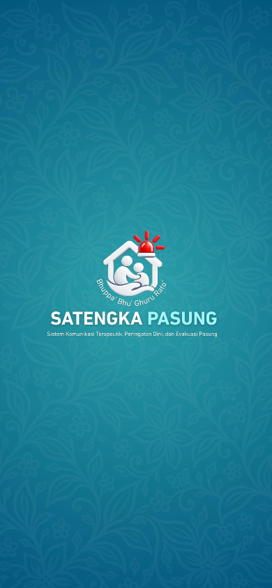
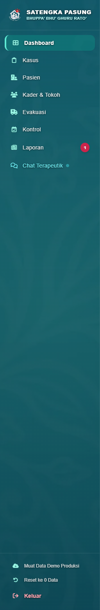
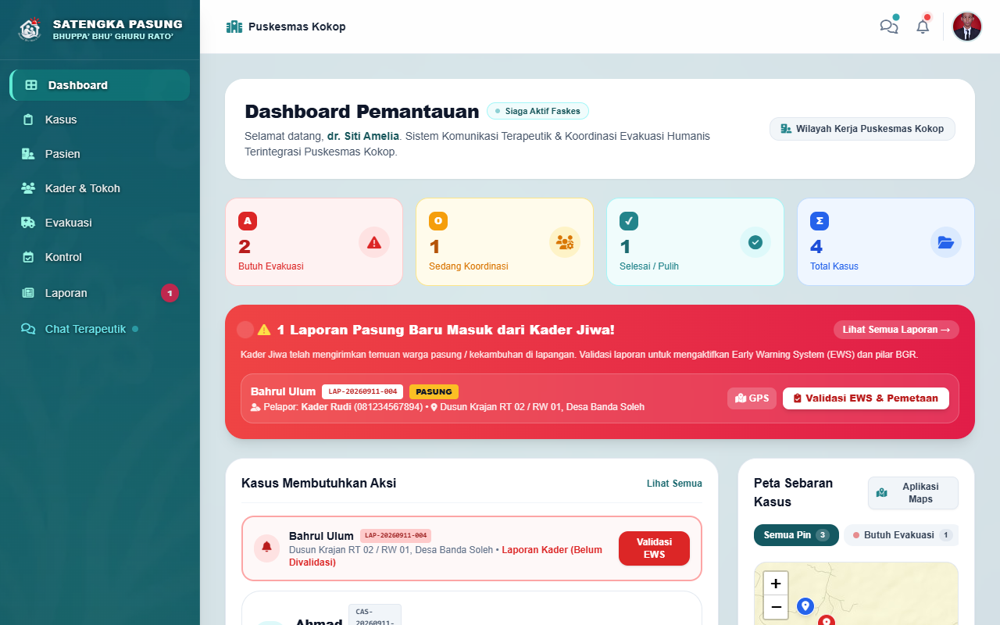

# 📌 Engineering Report: Implementasi Background Side Panel Batik & Splash Screen Poster Resmi
**Tanggal:** 2026-09-19  
**Lead Engineer:** Technical Project Manager & UI/UX DevSecOps Team  
**Status Sesi:** ✅ Resolved, Tested, & Verified  

---

## 1. 🎯 Ringkasan Eksekutif (Executive Summary)

Menindaklanjuti permintaan klien terkait pembaruan aset visual branding:
1. **Background Side Panel (`#nakesSidebar`)**: Menggunakan motif batik Madura `assets/background_opt.webp` dengan gradasi overlay gelap terukur agar teks menu, lencana peran, dan ikon faskes tetap kontras dan terbaca jelas.
2. **Splash Screen (`#appSplashScreen`)**: Menggunakan poster vertikal resmi dari dokumen riset (`assets/pdf_extracted/page_3_img_2.jpeg` disalin ke `assets/splash_official.jpeg`) dengan tampilan poster utuh yang telah terintegrasi motif batik, logo 3D, dan teks branding.

Kedua pembaruan telah diimplementasikan di seluruh halaman (`index.html`, `login.html`, `register.html`) dan telah diverifikasi secara visual melalui uji otomatis Playwright pada viewport desktop dan mobile (390 x 844 px).

---

## 2. 🖼️ Bukti Visual Antarmuka (UI Proof)

| Komponen | Tangkapan Layar Tampilan Nyata | Status & Keterangan |
| :--- | :--- | :--- |
| **Official Splash Screen (Mobile 390x844)** |  | ✅ Menggunakan poster vertikal resmi `page_3_img_2.jpeg` utuh & loading bar halus. |
| **Side Panel Nakes (Batik Background)** |  | ✅ Motif batik `background_opt.webp` tampil elegan dengan kontras teks tajam. |
| **Full Dashboard Desktop** |  | ✅ Harmonisasi side panel batik gelap dengan dashboard kerja faskes. |

---

## 3. 🚀 Detail Perubahan Kode Fisik (Before vs After Code Diff)

### A. Side Panel Nakes (`index.html`)
```diff
- <aside id="nakesSidebar"
-   class="fixed md:static inset-y-0 left-0 z-40 w-72 md:w-64 bg-slate-900 text-slate-300 flex flex-col justify-between shrink-0 shadow-2xl md:shadow-xl ...">
+ <aside id="nakesSidebar"
+   style="background: linear-gradient(180deg, rgba(15, 23, 42, 0.88) 0%, rgba(13, 34, 38, 0.92) 100%), url('./assets/background_opt.webp') center center / cover no-repeat;"
+   class="fixed md:static inset-y-0 left-0 z-40 w-72 md:w-64 text-slate-300 flex flex-col justify-between shrink-0 shadow-2xl md:shadow-xl -translate-x-full md:translate-x-0 transition-transform duration-300 ease-in-out border-r border-slate-800/80">
```

### B. Splash Screen CSS (`index.html`, `login.html`, `register.html`)
```diff
- #appSplashScreen {
-   background: linear-gradient(180deg, rgba(16, 67, 73, 0.45) 0%, rgba(20, 88, 97, 0.35) 50%, rgba(14, 58, 64, 0.55) 100%), url('./assets/background_opt.webp') no-repeat center center;
-   background-size: cover;
- }
+ #appSplashScreen {
+   background: #17656e url('./assets/splash_official.jpeg') center center / cover no-repeat;
+   transition: opacity 0.5s cubic-bezier(0.4, 0, 0.2, 1), visibility 0.5s ease;
+ }
+ @media (min-width: 768px) {
+   #appSplashScreen {
+     background-size: contain;
+     background-color: #17656e;
+   }
+ }
```

---

## 4. 🧪 Hasil Uji Kualitas (Quality Assurance)

- **Audit DevSecOps Anti-Slop**: **100% PASS** (Bebas placeholder, kode produksi bersih).
- **Automated Playwright Suite**: **100% PASS** pada desktop dan mobile viewport.
