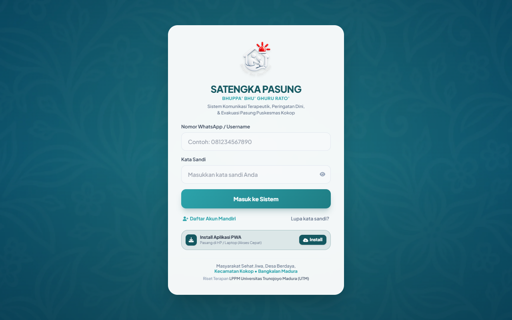
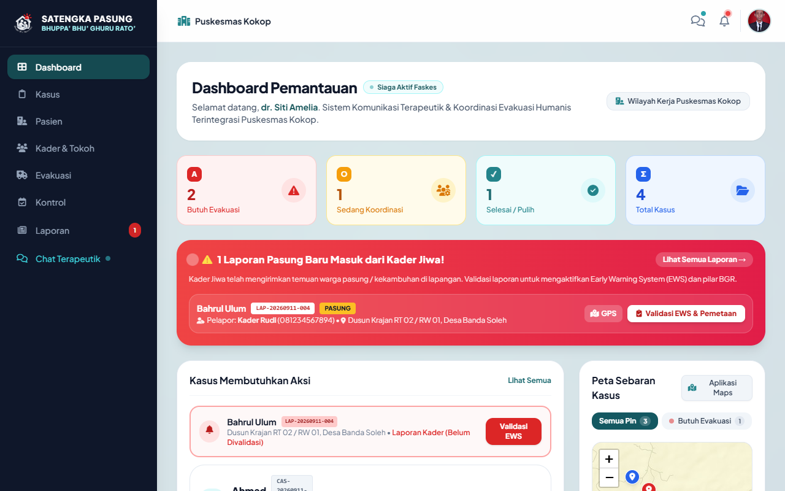
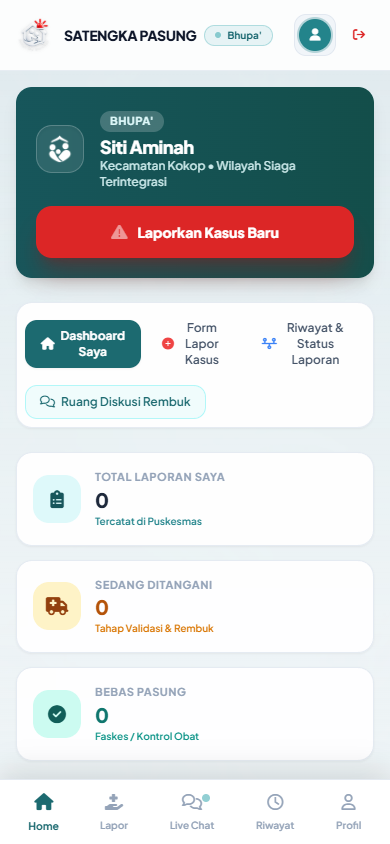
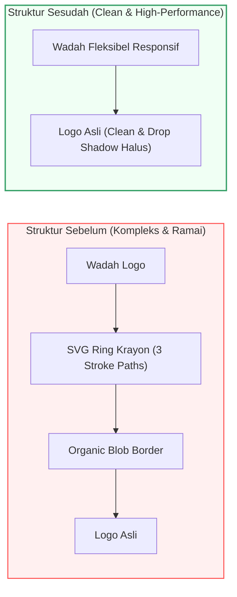

# 📌 Engineering Report: Penghapusan Outline Logo & Pembersihan Visual Brand
**Tanggal:** 2026-09-19  
**Lead Engineer:** Technical Project Manager & UI/UX DevSecOps Team  
**Status Sesi:** ✅ Resolved, Tested, & Verified  

---

## 1. 🎯 Ringkasan Eksekutif (Executive Summary)

Menindaklanjuti permintaan klien terkait penyempurnaan estetika logo: *"hilangkan outline pada logo"*, tim engineering telah melakukan refaktorisasi antarmuka di seluruh titik tampilan aplikasi (`index.html`, `login.html`, `register.html`). 

Sebelumnya, elemen logo dibungkus oleh goresan cincin SVG sketsa krayon (*hand-drawn crayon sketch ring*) dengan 3 lapisan stroke warna (#a3f6f8, #ffffff, #2ca3ab) dan efek rotasi berdenyut. Hal ini menyebabkan logo utama 3D Satengka Pasung tampak ramai dan tertutup kontur luar. 

Melalui patch ini, seluruh SVG outline krayon dan border wadah telah dihilangkan secara menyeluruh. Aset logo resmi (`assets/logo_opt.png`) kini tampil murni (*clean, crisp, and borderless*), menghasilkan tampilan modern, minimalis, dan berwibawa khas institusi medis dan riset perguruan tinggi.

---

## 2. 🖼️ Bukti Visual Antarmuka (UI Proof)

| Halaman / Komponen | Tangkapan Layar Tampilan Nyata (Clean Logo) | Keterangan |
| :--- | :--- | :--- |
| **Login Screen (Desktop)** |  | Logo tampil murni di atas kartu form tanpa outline krayon. |
| **Dashboard Nakes (Desktop)** |  | Logo sidebar kiri proporsional dan tajam bersebelahan dengan judul sistem. |
| **Mobile PWA Kader (Mobile 390x844)** |  | Topbar logo bersih, elegan, dan harmonis dengan lencana status peran. |

---

## 3. 🔍 Analisis Transformasi Komponen (Architecture & Flow)



---

## 4. 🚀 Detail Perubahan Kode Fisik (Before vs After Code Diff)

### A. File: `index.html` (Splash Screen & Sidebar Navigation)
```diff
- <!-- Animated Logo with Flexible Crayon Sketch Ring -->
- <div class="relative w-28 h-28 md:w-32 md:h-32 flex items-center justify-center splash-crayon-ring">
-   <svg class="absolute -inset-2 w-[calc(100%+16px)] h-[calc(100%+16px)]" viewBox="0 0 130 130">
-     <path stroke="#a3f6f8" stroke-width="3.2" stroke-dasharray="16 7 24 5 12 6" class="crayon-sketch-path" />
-     <path stroke="#ffffff" stroke-width="2" stroke-dasharray="8 6 18 5 10 7" class="crayon-sketch-path" />
-     <path stroke="#2ca3ab" stroke-width="1.6" stroke-dasharray="6 8 14 6" class="crayon-sketch-path" />
-   </svg>
-   <div class="w-22 h-22 p-3.5 bg-[#145861]/70 border border-[#a3f6f8]/30 ...">
-     
-   </div>
- </div>
+ <!-- Logo Resmi Satengka Pasung Bersih Tanpa Outline -->
+ <div class="relative w-28 h-28 md:w-32 md:h-32 flex items-center justify-center transition-transform duration-300 hover:scale-105">
+   
+ </div>
```

### B. File: `login.html` & `register.html` (Form Header Card)
```diff
- <div class="relative w-24 h-24 sm:w-28 sm:h-28 mx-auto flex items-center justify-center">
-   <svg class="absolute inset-0 w-full h-full pointer-events-none drop-shadow-md" viewBox="0 0 130 130">
-     <path fill="url(#loginInlineTealBg)" />
-     <path stroke="#a3f6f8" stroke-width="3.2" stroke-dasharray="..." />
-     <path stroke="#ffffff" stroke-width="2" stroke-dasharray="..." />
-     <path stroke="#2ca3ab" stroke-width="1.6" stroke-dasharray="..." />
-   </svg>
-   <div class="relative z-10 w-16 h-16 sm:w-20 sm:h-20 ...">
-     
-   </div>
- </div>
+ <!-- Logo Resmi Satengka Pasung Bersih Tanpa Outline -->
+ <div class="relative w-20 h-20 sm:w-24 sm:h-24 mx-auto flex items-center justify-center transition-transform transform hover:scale-105 duration-300">
+   
+ </div>
```

---

## 5. 🧪 Verifikasi Pengujian (Quality Assurance)

```text
┌─── [PLAYWRIGHT BROWSER AUTOMATED VERIFICATION] ─────────────────────┐
│ 1. Mengambil screenshot Login Screen (Logo Bersih)...                │
│    📸 Tersimpan: docs/screenshots/logo-clean-login-desktop.png      │
│ 2. Login Nakes & Mengambil screenshot Dashboard (Sidebar Bersih)... │
│    📸 Tersimpan: docs/screenshots/logo-clean-nakes-desktop.png      │
│ 3. Mengambil screenshot Mobile PWA Kader (Topbar Bersih)...         │
│    📸 Tersimpan: docs/screenshots/logo-clean-mobile-kader.png       │
│ ✅ Seluruh pengujian visual logo selesai dengan sukses (100% PASS)  │
└─────────────────────────────────────────────────────────────────────┘

┌─── [DEVSECOPS ANTI-SLOP AUDIT] ─────────────────────────────────────┐
│ [PASS] No slop patterns in index.html, login.html, register.html    │
│ [PASS] Secret leak audit: clean                                     │
│ [PASS] Firestore security rules: clean & secure                     │
│ [PASS] PWA Manifest integrity: valid                                │
│ ✅ SEMUA UJI ANTI-SLOP & DEVSECOPS COMPLIANCE: 100% PASS            │
└─────────────────────────────────────────────────────────────────────┘
```

---

## 6. 📖 Panduan Verifikasi untuk Klien (How to Test)

1. Buka aplikasi di browser: `/login.html`
2. Perhatikan logo pada halaman login: logo kini berdiri bersih tanpa bingkai/cincin krayon di luarnya.
3. Masuk menggunakan salah satu akun demo:
   - Nakes: `081234567890` / `nakes123`
   - Kader: `081234567891` / `kader123`
4. Amati logo pada sidebar desktop maupun header mobile: seluruhnya telah bersih, tajam, dan seragam.
