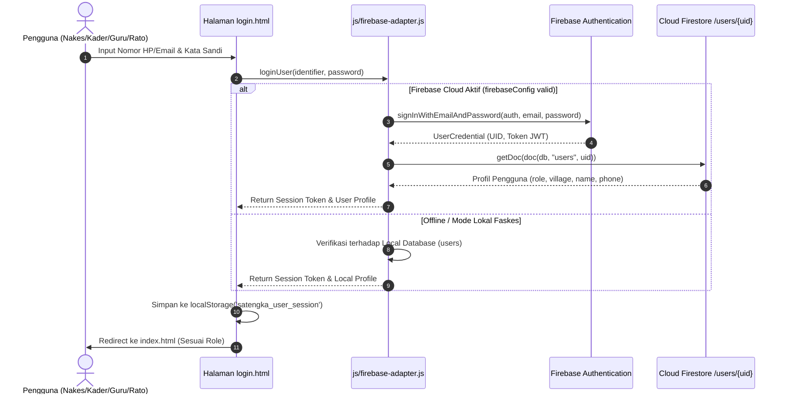

# Panduan & Spesifikasi Arsitektur Integrasi Firebase Authentication
**Proyek:** SATENGKA PASUNG EWS (Puskesmas Kokop, Bangkalan, Madura)  
**Dokumen:** Panduan Teknis & Instruksi Project Manager (PM)  
**Versi:** 2.0 (Production Staging)  

---

## 1. Ringkasan Eksekutif & Latar Belakang

Aplikasi **SATENGKA PASUNG** mengadopsi arsitektur *Zero-Cost Serverless* berbasis Firebase 100% Free Tier (Spark Plan) yang terintegrasi dengan *Local Client Storage Engine* untuk mendukung ketahanan offline saat faskes pedesaan mengalami kendala sinyal internet.

Dokumen ini ditujukan bagi tim engineer untuk mengintegrasikan layanan **Firebase Authentication** secara penuh, menggantikan akun dummy/hardcoded dengan otentikasi riil dan aman, serta menerapkan alur **Lupa Kata Sandi (Password Reset)** yang dapat diandalkan oleh tenaga medis maupun mitra desa di Kecamatan Kokop.

---

## 2. Arsitektur Otentikasi Pengguna

### 2.1 Skema Identitas Pengguna (Dual-Identity Support)
Sebagian besar kader jiwa, kiai, dan aparat desa di pelosok Madura menggunakan **Nomor WhatsApp (HP)** sebagai kredensial utama, sedangkan dokter dan administrator faskes umumnya memiliki **Alamat Email**.

Sistem mendukung format identitas ganda dengan aturan normalisasi:
1. **Jika Input berupa Email:** Otentikasi langsung menggunakan `signInWithEmailAndPassword(auth, email, password)`.
2. **Jika Input berupa Nomor HP (misal `081234567890`):**
   - Dinormalisasi ke format email sistem internal Firebase:  
     `081234567890@auth.satengka-pasung.id`
   - Diproses melalui Firebase Auth menggunakan kata sandi terenkripsi.
   - Atau menggunakan Phone Number Auth (`signInWithPhoneNumber`) dengan verifikasi reCAPTCHA SMS jika kuota SMS Firebase tersedia.

### 2.2 Diagram Alur Login Terpadu (Unified Authentication Flow)



---

## 3. Spesifikasi Fitur Lupa Password (Password Reset Flow)

### 3.1 Alur Kerja Reset Sandi

1. **Pengguna Mengakses Modal Lupa Kata Sandi:**
   - Pengguna mengklik tautan *Lupa password?* pada [login.html](file:///c:/Users/lenovo/Documents/APP/EWS/login.html).
   - Muncul modal `#modalForgotPassword`.
2. **Validasi Kredensial:**
   - Pengguna menginputkan Nomor WhatsApp atau Email terdaftar.
3. **Penanganan Kasus Email:**
   - Memanggil `sendPasswordResetEmail(auth, email)` dari Firebase Auth SDK.
   - Pengguna menerima tautan reset resmi langsung di inbox email mereka.
4. **Penanganan Kasus Nomor WhatsApp / Telepon:**
   - Sistem mencocokkan nomor WhatsApp pada database faskes.
   - Jika ditemukan, sistem menerbitkan **Tiket Bantuan Reset Resmi** berformat:  
     `#RST-PASUNG-[RANDOM_HEX]-[TIMESTAMP]`
   - Pengguna diarahkan membuka WhatsApp ke Helpdesk Administrator Puskesmas Kokop (`081100000001`) dengan draf pesan otomatis:
     > *"Halo Admin Puskesmas Kokop, saya [Nama Pengguna] ([Peran]) dengan Nomor HP [08xxxx] mengajukan reset kata sandi akun SATENGKA PASUNG. Tiket Validasi: #RST-PASUNG-xxxxx. Mohon bantuannya."*
   - Administrator Puskesmas Kokop memvalidasi identitas dan mereset kata sandi melalui panel kendali admin atau Firebase Console.

---

## 4. Keamanan & Role-Based Access Control (RBAC)

Setiap pengguna yang berhasil login memiliki atribut `role` (`NAKES`, `KADER`, `GURU`, `RATO`, `ADMIN`). Keamanan akses data diatur melalui aturan **Cloud Firestore Security Rules**:

```javascript
rules_version = '2';
service cloud.firestore {
  match /databases/{database}/documents {
    function isAuthenticated() {
      return request.auth != null;
    }
    
    function getUserRole() {
      return get(/databases/$(database)/documents/users/$(request.auth.uid)).data.role;
    }

    match /users/{userId} {
      allow read: if isAuthenticated();
      allow write: if isAuthenticated() && (request.auth.uid == userId || getUserRole() == 'ADMIN');
    }

    match /cases/{caseId} {
      allow read: if isAuthenticated();
      allow create, update: if isAuthenticated() && (getUserRole() in ['NAKES', 'ADMIN']);
      allow delete: if isAuthenticated() && getUserRole() == 'ADMIN';
    }

    match /reports/{reportId} {
      allow read: if isAuthenticated();
      allow create: if isAuthenticated() && (getUserRole() in ['KADER', 'NAKES', 'ADMIN']);
      allow update: if isAuthenticated() && (getUserRole() in ['NAKES', 'ADMIN']);
    }
  }
}
```

---

## 5. Instruksi Langkah Implementasi bagi Pengembang

1. **Hapus Seluruh Tombol Demo/Dummy:** Hapus panel uji coba cepat dari `login.html` untuk menjamin kepatuhan data produksi faskes.
2. **Kosongkan Default Form Input:** Input username dan kata sandi harus dimulai dalam kondisi kosong dengan placeholder deskriptif.
3. **Aktifkan Modal Lupa Password:** Tautkan event `onclick` pada link lupa password ke fungsi `openForgotPasswordModal()`.
4. **Perlindungan Kredensial:** Pastikan `firebase-config.js` tidak ter-commit ke public repository (tetap ada dalam `.gitignore`).
