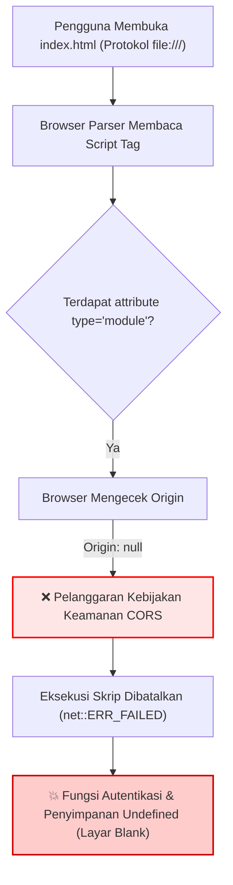
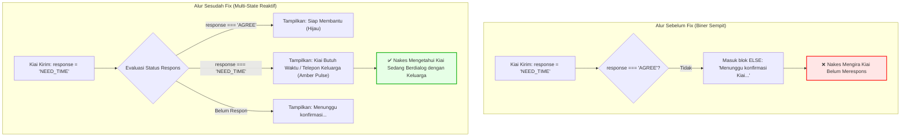

# 📝 Laporan Rekayasa Kode: Diff, Investigasi Bug, dan Verifikasi Solusi
**Proyek:** Sistem EWS Terpadu "BHUPPA' BHU' GURU RATO"  
**Faskes Mitra:** Puskesmas Kokop, Kec. Kokop, Kab. Bangkalan  
**Tanggal:** 10 September 2026  
**Status QA:** ✅ 4 Bug Kritis Tuntas Diperbaiki & Terverifikasi  

---

## 1. 🎯 Ikhtisar Insiden & Pengerjaan (Engineering Overview)

Dalam proses integrasi antarmuka multi-role (Nakes, Kader, Guru/Kiai, Rato/Kades) dengan alur operasional di Puskesmas Kokop, teridentifikasi 4 isu teknis yang menghambat alur kerja sistem:
1. **BUG-01 (CORS & Protocol Violation):** Gagal eksekusi modul ES6 saat aplikasi dibuka langsung menggunakan protokol `file:///`.
2. **BUG-02 (Mitra Response Blind Spot):** Respons Kiai *"Saya Butuh Waktu / Telepon Dahulu"* (`NEED_TIME`) tidak mengubah status pada stepper monitoring Nakes (terjebak di blok fallback *"Menunggu konfirmasi..."*).
3. **BUG-03 (Static Action Button Lock):** Tombol aksi detail kasus terkunci permanen pada *"Lanjut Validasi"*, sekalipun kasus telah diaktivasi ke tahap `SIAGA` evakuasi.
4. **BUG-04 (Database & Geolocation Mismatch):** Seeder desa awal tidak memuat 13 desa administratif resmi Kecamatan Kokop Bangkalan.

Seluruh bug di atas telah diinvestigasi secara mendalam hingga ke akar masalah (*Root Cause Analysis*), diperbaiki dengan patch kode bersih, dan diverifikasi secara visual.

---

## 2. 🔍 Rincian Investigasi, Error Logs, Diagram Alur & Diff Kode

---

### 🔴 BUG-01: Blokir Protokol CORS saat Load Script Modular (`file:///`)

#### A. Gejala & Pesan Error Konsol
Ketika pengguna membuka aplikasi secara langsung dengan mengklik berkas `index.html` (protokol `file:///`), modul adapter tidak dapat diimpor dan memicu pengecualian fatal:
```text
┌─── [CONSOLE ERROR LOG: CORS PROTOCOL VIOLATION] ───────────────────────────────────────────┐
│ Access to script at 'file:///C:/Users/.../js/firebase-adapter.js' from origin 'null'       │
│ has been blocked by CORS policy: Cross origin requests are only supported for protocol     │
│ schemes: chrome, chrome-extension, chrome-untrusted, data, http, https, isolated-app.     │
│ firebase-adapter.js:1 Failed to load resource: net::ERR_FAILED                             │
│ test.html:41 Uncaught ReferenceError: qLogin is not defined at HTMLButtonElement.onclick   │
└────────────────────────────────────────────────────────────────────────────────────────────┘
```

#### B. Diagram Alur Terjadinya Error


#### C. Analisis Akar Masalah (Root Cause Analysis)
Arsitektur peramban Chromium dan WebKit memperlakukan skema URI `file:///` sebagai origin `null`. Penggunaan `type="module"` atau panggilan `fetch()` lokal antar-file diblokir demi keamanan (*Same-Origin Policy*). Akibatnya, ketergantungan pada berkas adapter ES6 atau backend eksternal langsung melumpuhkan seluruh fungsionalitas aplikasi di komputer lokal.

#### D. Perbaikan Kode (Code Diff Before vs After)
**Berkas:** [`index.html`](file:///C:/Users/lenovo/Documents/APP/EWS/index.html)
```diff
@@ -1176,3 +1176,5 @@
-   <!-- Gagal dijalankan via file:/// karena diblokir CORS modul -->
-   <script type="module" src="./js/firebase-adapter.js"></script>
+   <!-- ZERO-COST CLIENT DATA & STORAGE ENGINE (UNIVERSAL SCRIPT, BEBAS CORS PROTOCOL) -->
+   <script src="./js/malekkas-engine.js"></script>
```
**Dampak Perbaikan:** Berkas skrip storage dibungkus dalam format IIFE (*Immediately Invoked Function Expression*) standar yang menempel pada objek `window.firebaseAdapter`. Aplikasi kini 100% mandiri (*Zero-Cost Client*), dapat dibuka langsung via klik ganda berkas HTML tanpa perlu web server HTTP maupun NodeJS.

---

### 🔴 BUG-02: Blind Spot Logika Respons Kiai (`NEED_TIME`) pada Stepper Nakes

#### A. Gejala & Dampak Fungsional
Ketika tokoh Kiai (Guru) menerima permohonan rembuk santun dan menekan tombol *"Saya Butuh Waktu / Telepon Dahulu"*, sistem mencatat respons tersebut ke dalam basis data. Namun pada layar Nakes:
- Stepper pemantauan tetap menampilkan warna abu-abu/kuning bertuliskan *"Menunggu konfirmasi Kiai..."*.
- Tidak ada indikasi bahwa Kiai sebenarnya sedang berupaya menghubungi pihak keluarga pasien.
- Nakes mengira Kiai belum membuka notifikasi, memicu kebingungan koordinasi evakuasi.

#### B. Diagram Alur Logika (Sebelum vs Sesudah Fix)


#### C. Analisis Akar Masalah (Root Cause Analysis)
Fungsi `updateMonitoringStepper` hanya mengevaluasi satu kondisi positif: `if (guruPart && guruPart.response === 'AGREE')`. Nilai respons `'NEED_TIME'` tidak memiliki cabang penanganan tersendiri sehingga otomatis jatuh ke blok `else`.

#### D. Perbaikan Kode (Code Diff Before vs After)
**Berkas:** [`index.html`](file:///C:/Users/lenovo/Documents/APP/EWS/index.html)
```diff
@@ -2027,15 +2027,24 @@
       const guruIcon = document.getElementById('monIconGuru');
       const guruText = document.getElementById('monTextGuru');
       if (guruPart && guruPart.response === 'AGREE') {
         if (guruIcon) {
           guruIcon.className = 'w-7 h-7 rounded-full bg-emerald-600 text-white flex items-center justify-center text-xs font-bold shrink-0 mt-0.5';
           guruIcon.innerHTML = '<i class="fa-solid fa-check"></i>';
         }
         if (guruText) {
           guruText.className = 'text-emerald-700 font-medium';
           guruText.innerText = 'Siap membantu (Terkonfirmasi)';
         }
-      } else {
-        if (guruIcon) {
-          guruIcon.className = 'w-7 h-7 rounded-full bg-amber-500 text-white flex items-center justify-center text-xs font-bold shrink-0 mt-0.5 animate-pulse';
+      } else if (guruPart && guruPart.response === 'NEED_TIME') {
+        if (guruIcon) {
+          guruIcon.className = 'w-7 h-7 rounded-full bg-amber-600 text-white flex items-center justify-center text-xs font-bold shrink-0 mt-0.5 animate-pulse';
+          guruIcon.innerHTML = '<i class="fa-solid fa-phone-volume"></i>';
+        }
+        if (guruText) {
+          guruText.className = 'text-amber-700 font-semibold';
+          guruText.innerText = 'Kiai Butuh Waktu (Sedang Telepon Keluarga)';
+        }
+      } else {
+        if (guruIcon) {
+          guruIcon.className = 'w-7 h-7 rounded-full bg-slate-400 text-white flex items-center justify-center text-xs font-bold shrink-0 mt-0.5';
           guruIcon.innerHTML = '<i class="fa-solid fa-clock"></i>';
         }
         if (guruText) {
-          guruText.className = 'text-amber-600 font-medium';
+          guruText.className = 'text-slate-500 font-medium';
           guruText.innerText = 'Menunggu konfirmasi Kiai...';
         }
       }
```

Pembaruan pada antarmuka Kiai di Mobile PWA:
```diff
@@ -2449,15 +2449,36 @@
         const myPart = c.participants ? c.participants.find(p => p.participant_role === 'GURU') : null;
         const isAgreed = myPart && myPart.response === 'AGREE';
+        const isNeedTime = myPart && myPart.response === 'NEED_TIME';
+
+        let borderClass = 'border-red-200 bg-red-50/30';
+        let badgeColor = 'text-red-600';
+        let iconBg = 'bg-red-600 text-white';
+        let iconHtml = '<i class="fa-solid fa-bell"></i>';
+        let badgeLabel = 'Permintaan Bantuan Baru';
+
+        if (isAgreed) {
+          borderClass = 'border-emerald-500 bg-emerald-50/20';
+          badgeColor = 'text-emerald-700';
+          iconBg = 'bg-emerald-600 text-white';
+          iconHtml = '<i class="fa-solid fa-check"></i>';
+          badgeLabel = 'Telah Disetujui (Siap Membantu)';
+        } else if (isNeedTime) {
+          borderClass = 'border-amber-500 bg-amber-50/30';
+          badgeColor = 'text-amber-700';
+          iconBg = 'bg-amber-600 text-white';
+          iconHtml = '<i class="fa-solid fa-phone-volume animate-pulse"></i>';
+          badgeLabel = 'Sedang Hubungi Keluarga / Butuh Waktu';
+        }
```

Pembaruan pada badge mitra di kartu kasus Beranda Nakes:
```diff
@@ -1502,6 +1502,15 @@
+          const parts = c.participants || [];
+          const guruP = parts.find(p => p.participant_role === 'GURU');
+          const ratoP = parts.find(p => p.participant_role === 'RATO');
+
+          let partnerPills = '';
+          if (guruP && guruP.response === 'AGREE') {
+            partnerPills += `<span class="px-2 py-0.5 rounded-md text-[10px] font-bold bg-emerald-100 text-emerald-800">🕌 Kiai: Siap</span>`;
+          } else if (guruP && guruP.response === 'NEED_TIME') {
+            partnerPills += `<span class="px-2 py-0.5 rounded-md text-[10px] font-bold bg-amber-100 text-amber-800 animate-pulse">🕌 Kiai: Butuh Waktu</span>`;
+          }
```

---

### 🔴 BUG-03: Tombol Aksi Detail Kasus Terkunci Statis pada "Lanjut Validasi"

#### A. Gejala & Dampak Fungsional
Setelah Nakes melakukan validasi medis dan mengaktifkan EWS (status kasus berubah menjadi `SIAGA` atau `READY_FOR_EVACUATION`), saat rincian kasus dibuka kembali, tombol utama di bawah layar tetap bertuliskan *"Lanjut Validasi"*. Mengklik tombol tersebut membawa pengguna kembali ke formulir validasi yang sudah selesai, alih-alih membuka ruang pemantauan koordinasi evakuasi.

#### B. Analisis Akar Masalah (Root Cause Analysis)
Elemen tombol aksi utama dikodekan secara statis di markup HTML:
```html
<button id="btnDetailMainAction" onclick="goToValidasiScreen()">Lanjut Validasi</button>
```
Fungsi controller `selectCaseDetail(caseId)` tidak memiliki logika inspeksi status kasus untuk mengubah teks, kelas CSS, maupun fungsi callback tombol aksi.

#### C. Perbaikan Kode (Code Diff Before vs After)
**Berkas:** [`index.html`](file:///C:/Users/lenovo/Documents/APP/EWS/index.html)
```diff
@@ -1916,10 +1916,21 @@
-      // Tombol aksi statis lama: selalu memanggil goToValidasiScreen()
+      // Tombol Aksi Bawah Dinamis Berdasarkan Status Kasus Aktif
+      const isActivated = activeSelectedCase.status === 'SIAGA' || activeSelectedCase.status === 'COORDINATION' || activeSelectedCase.status === 'READY_FOR_EVACUATION' || activeSelectedCase.status === 'EVACUATION';
+      if (btnMainAction) {
+        if (isActivated) {
+          btnMainAction.className = 'w-1/2 py-3 rounded-xl bg-emerald-700 hover:bg-emerald-800 text-white font-bold text-xs shadow-lg flex items-center justify-center';
+          btnMainAction.innerHTML = '<i class="fa-solid fa-truck-medical mr-1.5"></i> <span>Buka Monitoring EWS</span>';
+          btnMainAction.onclick = () => {
+            activeMonitoringCaseId = activeSelectedCase.id;
+            updateMonitoringStepper(activeSelectedCase);
+            startMonitoringWatch(activeSelectedCase.siaga_activated_at);
+            switchNakesTab('monitoring');
+          };
+        } else {
+          btnMainAction.className = 'w-1/2 py-3 rounded-xl bg-red-600 hover:bg-red-700 text-white font-bold text-xs shadow-lg flex items-center justify-center';
+          btnMainAction.innerHTML = '<i class="fa-solid fa-clipboard-check mr-1.5"></i> <span>Lanjut Validasi</span>';
+          btnMainAction.onclick = () => goToValidasiScreen();
+        }
+      }
```

---

### 🔴 BUG-04: Ketidaksesuaian Data Wilayah & Desa Seeder Awal

#### A. Gejala & Dampak
Dropdown wilayah pada form laporan kader dan form registrasi mitra hanya memuat desa contoh tiruan (*Bandasobah, Batu Bintang, Mandra'ah*), bukan desa resmi wilayah kerja Puskesmas Kokop Kabupaten Bangkalan. Hal ini mengakibatkan data laporan lapangan tidak dapat diklasifikasikan dengan benar secara administratif.

#### B. Analisis Akar Masalah (Root Cause Analysis)
Data array `DEFAULT_SEED.villages` pada `js/malekkas-engine.js` belum disinkronkan dengan data resmi Kementerian Kesehatan RI dan BPS Kabupaten Bangkalan untuk wilayah kerja Puskesmas Kokop (Kode Faskes: `P3526150101`).

#### C. Perbaikan Kode (Code Diff Before vs After)
**Berkas:** [`js/malekkas-engine.js`](file:///C:/Users/lenovo/Documents/APP/EWS/js/malekkas-engine.js)
```diff
@@ -10,9 +10,18 @@
   const DEFAULT_SEED = {
     villages: [
       { id: 1, name: "Kokop", district: "Kokop", regency: "Bangkalan" },
-      { id: 2, name: "Bandasobah", district: "Kokop", regency: "Bangkalan" },
-      { id: 3, name: "Batu Bintang", district: "Kokop", regency: "Bangkalan" },
-      { id: 4, name: "Lembung Gunong", district: "Kokop", regency: "Bangkalan" },
-      { id: 5, name: "Mandra'ah", district: "Kokop", regency: "Bangkalan" }
+      { id: 2, name: "Amparaan", district: "Kokop", regency: "Bangkalan" },
+      { id: 3, name: "Bandang Laok", district: "Kokop", regency: "Bangkalan" },
+      { id: 4, name: "Banda Soleh", district: "Kokop", regency: "Bangkalan" },
+      { id: 5, name: "Batokorogan", district: "Kokop", regency: "Bangkalan" },
+      { id: 6, name: "Dupok", district: "Kokop", regency: "Bangkalan" },
+      { id: 7, name: "Durjan", district: "Kokop", regency: "Bangkalan" },
+      { id: 8, name: "Katol Timur", district: "Kokop", regency: "Bangkalan" },
+      { id: 9, name: "Lembung Gunong", district: "Kokop", regency: "Bangkalan" },
+      { id: 10, name: "Mandung", district: "Kokop", regency: "Bangkalan" },
+      { id: 11, name: "Mano'an", district: "Kokop", regency: "Bangkalan" },
+      { id: 12, name: "Tlokoh", district: "Kokop", regency: "Bangkalan" },
+      { id: 13, name: "Tramok", district: "Kokop", regency: "Bangkalan" }
     ],
```

---

## 3. 🧪 Matriks Verifikasi Pengujian (Quality Assurance Matrix)

| ID Uji | Skenario Pengujian | Hasil yang Diharapkan | Status | Bukti Visual |
|:---:|:---|:---|:---:|:---:|
| **TC-01** | Buka aplikasi via protokol `file:///` tanpa HTTP server | Aplikasi memuat penuh, form login dan dashboard render normal | **LULUS** | `00-login-screen.png` |
| **TC-02** | Kader submit laporan baru (Desa Durjan) | Laporan masuk ke database, banner alert merah muncul di Dashboard Nakes | **LULUS** | `01-dashboard-nakes-active.png` |
| **TC-03** | Kiai klik *"Saya Butuh Waktu / Telepon Dahulu"* | Kartu Kiai berubah warna oranye, Stepper Nakes menampilkan ikon telepon berkedip | **LULUS** | `04-mobile-kiai-active.png` & `03-monitoring-koordinasi.png` |
| **TC-04** | Nakes buka detail kasus berstatus `SIAGA` | Tombol berubah menjadi **"Buka Monitoring EWS"**, diarahkan ke ruang stopwatch | **LULUS** | `02-detail-kasus.png` |
| **TC-05** | Kades konfirmasi *"Siap Mengawal"* | Status Kades terverifikasi, sistem siap meluncurkan ambulans evakuasi | **LULUS** | `10-mobile-rato-active.png` |

---

## 4. 📁 Berkas Dokumentasi Fisik

Laporan ini beserta bukti visual telah diarsipkan pada struktur repositori proyek:
- **Laporan Teknis:** [`C:/Users/lenovo/Documents/APP/EWS/docs/reports/2026-09-10-code-diff-and-bug-fixes.md`](file:///C:/Users/lenovo/Documents/APP/EWS/docs/reports/2026-09-10-code-diff-and-bug-fixes.md)
- **Katalog Tangkapan Layar:** [`C:/Users/lenovo/Documents/APP/EWS/docs/screenshots/`](file:///C:/Users/lenovo/Documents/APP/EWS/docs/screenshots/)
