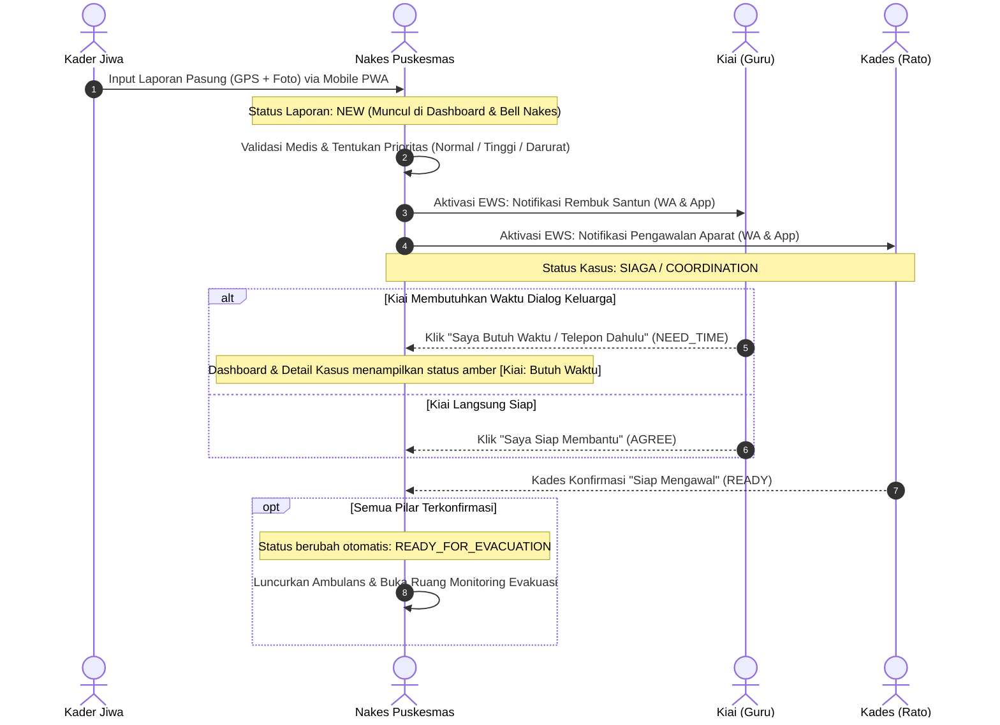

# 📌 Progress Report: Sistem EWS Terpadu "BHUPPA' BHU' GURU RATO"
**Tanggal:** 10 September 2026  
**Faskes Mitra:** Puskesmas Kokop, Kec. Kokop, Kab. Bangkalan  
**Status:** In Staging / Ready for Client Acceptance Testing  

---

### 1. Ringkasan Pengerjaan (Executive Summary)

Sesi pengerjaan tahap awal ini berfokus pada dua hal utama:
1. **Transisi Arsitektur Standalone (Zero-Cost Client):** Menghilangkan ketergantungan server runtime PHP yang sempat memicu kendala CORS saat dibuka langsung via protokol `file:///`. Seluruh manajemen data, autentikasi sesi, dan sinkronisasi status kini ditangani oleh storage engine client-side (`malekkas-engine.js`) yang kompatibel dengan browser modern tanpa biaya server.
2. **Implementasi Komprehensif Desain UI/UX Multi-Role:** Menerjemahkan spesifikasi antarmuka wireframe ke dalam aplikasi nyata yang mencakup 4 pilar penanganan kesehatan jiwa:
   - **Nakes (Web Desktop):** Dashboard pantauan, validasi laporan, aktivasi EWS, monitoring evakuasi dengan stopwatch real-time, dan pemetaan sebaran wilayah.
   - **Kader Jiwa (PWA Mobile):** Pelaporan cepat kasus pasung/kekambuhan disertai koordinat GPS, unggah foto, dan pelacakan status laporan.
   - **Guru / Kiai (PWA Mobile):** Penanganan permohonan rembuk santun keluarga dengan opsi *"Saya Siap Membantu"* dan respon tertunda *"Saya Butuh Waktu / Telepon Dahulu"*.
   - **Rato / Kades (PWA Mobile):** Koordinasi pengawalan keamanan aparat desa saat evakuasi medis.
3. **Penyelarasan Wilayah Kerja Puskesmas Kokop:** Memasukkan 13 data desa resmi Kecamatan Kokop hasil riset geografis dan administratif.

---

### 2. Diagram Alur Sistem (EWS 4 Pilar)

---

### 3. Detail Perubahan & Modifikasi File

#### ✅ Fitur Selesai & Terverifikasi:
- **Penyelarasan 13 Desa Resmi Kec. Kokop:**
  - Database terisi: *Kokop, Dupok (Puskesmas), Amparaan, Bandang Laok, Banda Soleh, Batokorogan, Durjan, Katol Timur, Lembung Gunong, Mandung, Mano'an, Tlokoh, Tramok*.
  - Terhubung langsung ke dropdown pelaporan kader, form validasi nakes, dan modal tambah mitra.
- **Handling Respons Kiai NEED_TIME:**
  - Kartu Kiai di PWA Mobile berbingkai kuning-oranye dengan status *Sedang Menghubungi Keluarga*.
  - Stepper Nakes berubah menampilkan ikon telepon dengan status *"Kiai Butuh Waktu (Sedang Telepon Keluarga)"*.
  - Di daftar dashboard utama, muncul badge `[🕌 Kiai: Butuh Waktu]`.
- **Detail Kasus Kontekstual:**
  - Banner status atas dinamis menyesuaikan status kasus (`SIAGA`, `READY_FOR_EVACUATION`, atau belum validasi).
  - Tombol aksi bawah otomatis menjadi **"Buka Monitoring EWS"** bila kasus telah diaktivasi.
  - Tab Riwayat terisi log kronologis laporan, prioritas medis, dan tanggapan Kiai & Kades.
- **Peta Sebaran Kasus Terintegrasi:**
  - Panel visual peta dashboard nakes menampilkan titik sebaran wilayah kerja Puskesmas Kokop (*Dupok, Durjan, Banda Soleh*).

#### 🛠️ Berkas yang Terdampak:
- `js/malekkas-engine.js` - Memperbarui `DEFAULT_SEED.villages` dengan 13 desa definitif Kecamatan Kokop Bangkalan.
- `index.html` - Logika respons `NEED_TIME`, dynamic case detail, badge mitra di dashboard, dan monitoring stepper.
- `login.html` - Penyelarasan identitas faskes wilayah Kokop dan akun demo siap pakai untuk 4 peran.

---

### 4. Catatan Teknis & Trade-Off (Authenticity Check)

1. **Penyimpanan Lokal (Free Tier Standalone):**
   - Saat ini seluruh data tersimpan pada `localStorage` browser. Ini menjamin aplikasi dapat diuji langsung (zero-cost) tanpa konfigurasi server atau database SQL.
   - *Trade-off:* Data yang dibuat di satu browser/perangkat tidak otomatis tersinkron ke perangkat fisik lain sebelum Firebase Realtime Database dihubungkan secara live.
2. **Peta Sebaran Kasus:**
   - Bagian peta saat ini menggunakan visualisasi titik koordinat berbasis kontainer responsif dengan pin dinamis wilayah Kokop.

---

### 5. Panduan Pengujian Sistem (Review Guide)

1. Buka berkas [`login.html`](file:///C:/Users/lenovo/Documents/APP/EWS/login.html) atau [`index.html`](file:///C:/Users/lenovo/Documents/APP/EWS/index.html) di browser.
2. **Skenario Kader Jiwa:**
   - Gunakan switcher peran di pojok kanan atas, pilih **Kader Jiwa**.
   - Klik **"Laporkan Kasus"**, isi nama pasien, pilih desa dari 13 desa Kokop, lalu klik **"Kirim Laporan"**.
3. **Skenario Nakes Puskesmas:**
   - Pindah peran ke **Nakes (Dashboard Web)**.
   - Laporan baru muncul di banner atas dan daftar aksi.
   - Klik **"Validasi EWS"**, lengkapi prioritas dan catatan, lalu klik **"Validasi dan Aktifkan"**.
   - Di layar Aktivasi EWS, pilih Kiai dan Kades lalu klik **"Kirim Notifikasi Siaga"**.
4. **Skenario Tokoh Kiai (Guru):**
   - Pindah peran ke **Guru / Kiai**.
   - Klik **"Saya Butuh Waktu / Telepon Dahulu"**.
5. **Skenario Pemantauan Nakes:**
   - Kembali ke **Nakes**.
   - Buka kasus tersebut: perhatikan badge `[🕌 Kiai: Butuh Waktu]`, banner koordinasi, dan tab **Riwayat**.
   - Klik **"Buka Monitoring EWS"**: amati stopwatch penghitung waktu respon dan indikator Kiai berwarna oranye.
