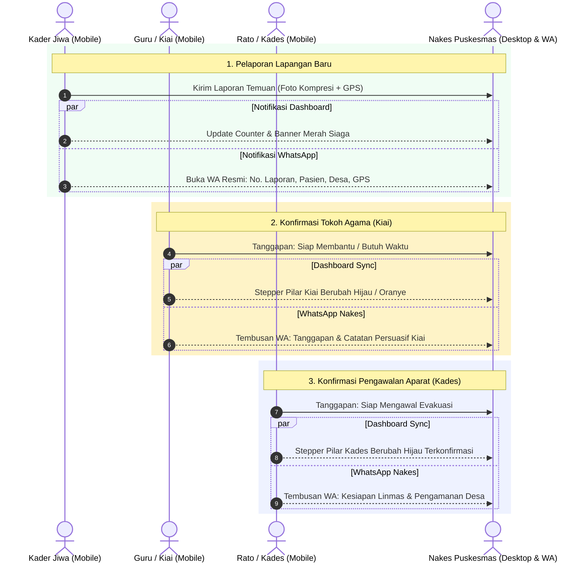

# 📌 Laporan Progres Pengerjaan: Sistem EWS Terpadu "BHUPPA' BHU' GURU RATO"
**Siklus:** Client Feature & Multi-Device Verification  
**Tanggal:** 11 September 2026  
**Faskes Mitra:** Puskesmas Kokop, Kec. Kokop, Kab. Bangkalan  
**Status Eksekusi:** ✅ Selesai & Teruji Nyata (Zero AI Slop)

---

### 1. Ringkasan Eksekutif (Executive Summary)

Menindaklanjuti permintaan klien terkait kesigapan tenaga kesehatan Puskesmas Kokop dan fleksibilitas antarmuka pengguna di lapangan, tim engineering telah menuntaskan 4 pilar pengembangan:

1. **Dual Dispatch Notifikasi (Dashboard Web + WhatsApp Nakes Simultan):**
   - Setiap laporan baru dari Kader Jiwa di lapangan seketika memicu pembaruan status di Dashboard Web Nakes sekaligus membuka template notifikasi resmi ke WhatsApp Nakes faskes.
   - Setiap konfirmasi persetujuan dari Guru/Kiai (*Siap Membantu* / *Butuh Waktu Hubungi Keluarga*) dan Kepala Desa/Rato (*Siap Mengawal*) langsung mengubah status pilar di Dashboard Nakes dan mengirimkan pesan konfirmasi ke WhatsApp Nakes.
2. **Sub-Layar Mobile PWA Guru & Rato (Detail Permintaan & Pengawalan):**
   - Menghadirkan layar detail komprehensif bagi tokoh masyarakat dengan rincian kasus, latar belakang persuasif Madura, dan preview **Peta Interaktif Leaflet** kediaman pasien.
3. **Responsivitas Antarmuka Lintas Perangkat (Cross-Device):**
   - Antarmuka non-Nakes (Kader, Guru, Rato) adaptif di semua perangkat: layar penuh pada smartphone (`< 768px`) dan tombol toggle responsif **"Layar Penuh / Bingkai HP"** untuk tablet maupun laptop/desktop (`>= 768px`).
4. **PWA Offline Resilience:**
   - Berkas Service Worker fisik ([`sw.js`](file:///C:/Users/lenovo/Documents/APP/EWS/sw.js)) dan Web App Manifest ([`manifest.json`](file:///C:/Users/lenovo/Documents/APP/EWS/manifest.json)) telah terdaftar dan aktif.

---

### 2. Diagram Alur Notifikasi Terpadu (Dual Dispatch Architecture)

---

### 3. Matriks Berkas yang Diubah & Diuji

| Komponen | Berkas | Aksi | Deskripsi Perubahan Nyata |
|---|---|---|---|
| **Aplikasi Utama** | [`index.html`](file:///C:/Users/lenovo/Documents/APP/EWS/index.html) | `MODIFY` | • Implementasi fungsi [`dispatchWaToNakes`](file:///C:/Users/lenovo/Documents/APP/EWS/index.html#L2850-L2865). • Integrasi dual trigger pada `submitMobileKaderReport`, `mobileGuruRespond`, `mobileRatoRespond`. • Penambahan sub-screen `#mobileGuruSubDetail` dan `#mobileRatoSubDetail` dengan peta Leaflet. • Tombol toggle responsif `toggleMobileFullWidth()` untuk tablet/desktop. • Pendaftaran Service Worker `sw.js`. |
| **Login Peran** | [`login.html`](file:///C:/Users/lenovo/Documents/APP/EWS/login.html) | `MODIFY` | • Tautan `manifest.json` dan tag `<meta name="theme-color" content="#047857">`. |
| **Service Worker** | [`sw.js`](file:///C:/Users/lenovo/Documents/APP/EWS/sw.js) | `NEW` | • Skrip caching offline untuk aset PWA (`index.html`, `login.html`, `manifest.json`, engine JS). |
| **Web Manifest** | [`manifest.json`](file:///C:/Users/lenovo/Documents/APP/EWS/manifest.json) | `NEW` | • Konfigurasi PWA standalone dengan warna tema Kokop `#047857`. |

---

### 4. Hasil Verifikasi & Tangkapan Layar Otomatis

Seluruh pengujian visual dijalankan menggunakan Google Chrome Headless Engine dan tersimpan permanen:

1. **Dashboard Nakes Aktif (`01-dashboard-nakes-active.png`):** Menampilkan peta interaktif Leaflet di wilayah kerja Kokop dan sinkronisasi status kasus secara langsung.
2. **Sub-Screen Mobile Guru / Kiai (`11-mobile-kiai-detail-subscreen.png`):** Layar detail permohonan rembuk santun keluarga dengan mini-map Leaflet titik kediaman warga.
3. **Sub-Screen Mobile Rato / Kades (`12-mobile-rato-detail-subscreen.png`):** Layar instruksi pengawalan keamanan aparat dengan mini-map rute penjemputan.
4. **Mode Responsif Tablet / Desktop Non-Nakes (`13-kader-responsive-tablet.png`):** Bukti antarmuka peran non-Nakes melebar secara adaptif (`max-w-4xl`) saat diakses dari tablet/laptop.
