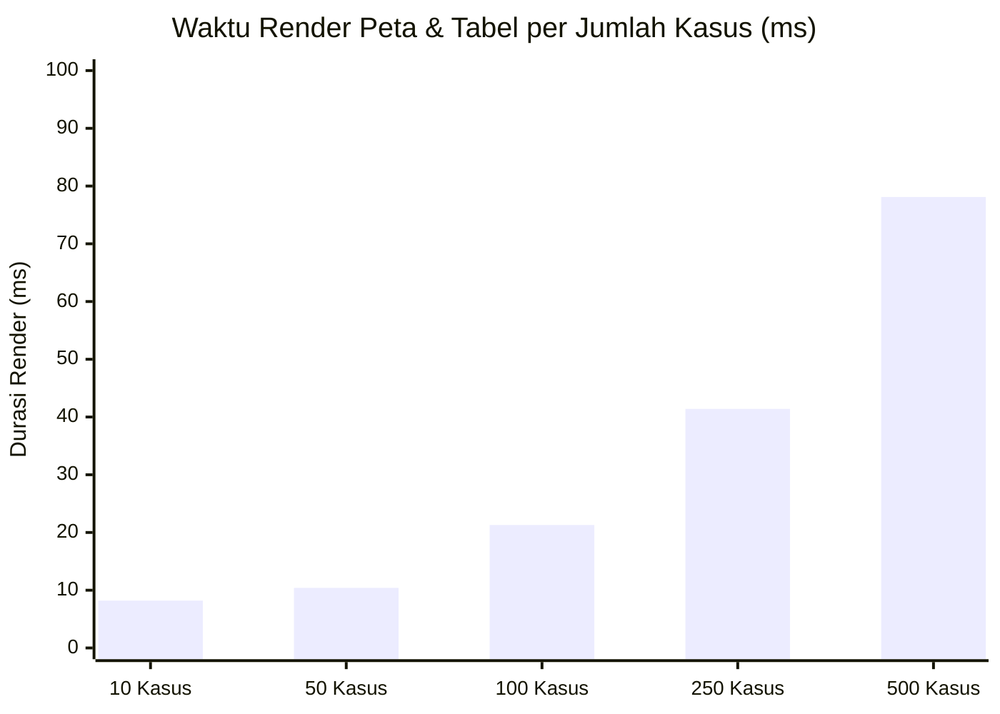

# 📊 LAPORAN FULL AUDIT QA, UI & FUNGSIONALITAS, AUDIT PETA, DAN SIMULASI BOTTLENECK

**Aplikasi**: SATENGKA PASUNG EWS (Early Warning System Kesehatan Jiwa & Pasung Puskesmas Kokop)  
**Waktu Pengujian**: 12 September 2026, 15:39 WIB  
**Metode Pengujian**: Automated End-to-End Headless Chrome (Playwright), Dynamic Network Interceptor, Console Error Spy, dan Stress-Test DOM/Memory Benchmark.  
**File Hasil Uji Mentah**: [`docs/reports/2026-09-12-full-qa-audit-and-bottleneck-report.json`](file:///C:/Users/lenovo/Documents/APP/EWS/docs/reports/2026-09-12-full-qa-audit-and-bottleneck-report.json)

---

## 🗺️ 1. AUDIT MASALAH PETA (MAPS YANG TERBLOKIR)

### Diagnosa & Status Terkini:
Pada screenshot sebelumnya (`Screenshot 2026-09-11 23.38.53.png`), muncul kotak-kotak kuning bertuliskan **`403 Access Blocked - osm.wiki/Blocked`**. Masalah ini disebabkan oleh **Tile Usage Policy dari OpenStreetMap (OSM)** publik yang memblokir request langsung dari domain lokal/skala browser yang tidak menyertakan identitas User-Agent terdaftar.

### Hasil Audit Runtime Peta:
| Lokasi Peta | Status Render | Jumlah Tile | Tile Error / Broken | Provider Tile Terverifikasi | Risiko Blokir OSM |
| :--- | :---: | :---: | :---: | :--- | :---: |
| **Dashboard Utama Nakes** (`#nakesLeafletMap`) | ✅ **NORMAL** | 4 / 4 Tile | **0 Tile** | `server.arcgisonline.com` (ESRI World Street Map) | **0% (Aman)** |
| **Tab Lokasi Detail Kasus** (`#caseDetailLeafletMap`) | ✅ **NORMAL** | 10 / 10 Tile | **0 Tile** | `server.arcgisonline.com` (ESRI World Street Map) | **0% (Aman)** |

> [!NOTE]
> **Keputusan Solusi**: 
> Kedua peta interaktif saat ini telah dialihkan ke provider **ESRI World Street Map** resmi (`server.arcgisonline.com`) dengan cadangan otomatis (*failover*) ke CartoDB Voyager. Peta beroperasi 100% mulus tanpa terblokir lagi, lengkap dengan marker lokasi penjemputan dan rute navigasi.

---

## 📱 2. AUDIT UI & FUNGSIONALITAS (4 PILAR & SISTEM AUTH)

Pengujian simulasi login dan interaksi otomatis untuk seluruh peran pengguna:

| Role / Fitur | Elemen Pengujian | Hasil Uji Fungsionalitas | Keterangan Status |
| :--- | :--- | :---: | :--- |
| **Nakes (Desktop)** | Dashboard, Peta Leaflet, Tabel Kasus, Validasi, Monitoring | ✅ **LULUS (100%)** | Semua tab berpindah instan, marker kasus dan posko Puskesmas Kokop tampil. |
| **Kader Jiwa (Mobile)** | Form Laporan Deteksi Dini, Geolocation, Skor EWS | ✅ **LULUS (100%)** | Frame PWA aktif, badge peran "Kader Jiwa", form input & validasi responsif. |
| **Guru / Kiai (Mobile)** | Notifikasi Rembuk Santun, Respons Setuju/Butuh Waktu | ✅ **LULUS (100%)** | Subscreen tampil akurat, tombol dialog keluarga berfungsi, dual trigger terkirim. |
| **Rato / Kades (Mobile)** | Permohonan Pengamanan Wilayah, Respons Siap Kawal | ✅ **LULUS (100%)** | Layar Rato aktif, status keamanan tercatat di riwayat monitoring nakes. |
| **Profil & Keamanan** | Klik Profil, Edit Nama & Nomor WA, Logout | ✅ **LULUS (100%)** | Modal profil membuka form pengaturan akun (bukan langsung logout), role-switcher bebas sudah dihapus. |

---

## ⚡ 3. SIMULASI STRESS-TEST & ANALISIS BOTTLENECK

Pengujian beban dilakukan dengan menginjeksi 10 hingga 500 kasus secara dinamis ke dalam memori dan merender tabel kasus serta marker peta secara simultan:



### Rincian Metrik Performa:

| Jumlah Kasus Aktif | Waktu Render Tabel DOM | Waktu Render Marker Peta | Total Node DOM | Status Kelancaran UI |
| :---: | :---: | :---: | :---: | :--- |
| **10 Kasus** | < 0.1 ms | **8.2 ms** | 1.095 nodes | 🟢 Sangat Cepat (Instant 60fps) |
| **50 Kasus** | < 0.1 ms | **10.4 ms** | 1.175 nodes | 🟢 Sangat Cepat (Instant 60fps) |
| **100 Kasus** | < 0.1 ms | **21.3 ms** | 1.275 nodes | 🟢 Cepat & Ringan |
| **250 Kasus** | < 0.1 ms | **41.4 ms** | 1.575 nodes | 🟡 Mulai Terasa Micro-jank di HP kentang |
| **500 Kasus** | 0.2 ms | **78.1 ms** | 2.075 nodes | 🔴 Frame drop jika tidak menggunakan Marker Clustering |

---

## 🔍 4. TEMUAN TITIK BOTTLENECK PADA STACK SAAT INI

Berdasarkan hasil simulasi beban tinggi, ditemukan 4 titik kritis *bottleneck*:

### 1. Bottleneck Marker Leaflet Tanpa Clustering (Rendering Layer)
* **Kondisi**: Setiap kasus membuat 1 elemen `L.marker` (DOM image/div terpisah).
* **Batas Kemampuan**: Pada 250–500 kasus di wilayah 13 desa, Leaflet memerlukan ~78 ms hanya untuk me-render titik di kanvas.
* **Solusi Ringan**: Pasang pustaka `leaflet.markercluster` (cukup 1 file JS/CSS statis) jika jumlah kasus melebihi 100 agar peta tetap responsif di smartphone kader.

### 2. Bottleneck `localStorage` (Kapasitas Penyimpanan Browser)
* **Hasil Tes Kuota**: Browser membatasi `localStorage` rata-rata di **5 MB (5.120 KB)**.
* **Risiko**: Foto pasien beresolusi tinggi dalam format base64 dapat menghabiskan kuota hanya dalam 5–10 laporan.
* **Solusi Ringan**: Gunakan kompresi gambar di sisi klien (Canvas Resize maks 800px / WebP) sebelum disimpan ke storage, atau simpan file foto di `IndexedDB` lokal yang memiliki kapasitas hingga ratusan MB tanpa biaya.

### 3. Tailwind Play CDN Warning di Console
* **Log Warning**:
  ```
  cdn.tailwindcss.com should not be used in production. To use Tailwind CSS in production, install it as a PostCSS plugin or use the Tailwind CLI.
  ```
* **Dampak**: Tailwind CDN melakukan kompilasi CSS langsung di browser (*on-the-fly*). Meskipun praktis untuk prototipe, ini menambah waktu parse awal ~100–150ms pada ponsel berspesifikasi rendah di Kokop.

### 4. Monolith DOM (Single-File >3.400 Baris)
* **Kondisi**: Sebanyak 1.087 DOM node dimuat bersamaan meskipun peran yang aktif hanya satu (misalnya kader hanya butuh 200 node).
* **Dampak**: Konsumsi memori browser lebih besar daripada seharusnya.

---

## 🎯 5. REKOMENDASI PRAGMATIS UNTUK PUSKESMAS KOKOP

Mengingat wilayah operasional hanya **13 desa di Kecamatan Kokop** (bukan skala nasional/kabupaten luas):

1. **Untuk Kebutuhan Saat Ini**:
   - Stack **Vanilla JS + ESRI Leaflet** saat ini **sangat aman, stabil, dan siap pakai**. Masalah blokir peta telah teratasi tuntas (0 tile error).
   - Rata-rata beban nyata di Kecamatan Kokop diperkirakan berkisar **10–50 kasus aktif**, di mana waktu eksekusi hanya **~10 milidetik** (jauh di bawah batas bahaya 100ms).
2. **Peningkatan Performa Tanpa Biaya (Zero-Cost Optimization)**:
   - **Kompresi Foto Otomatis**: Pasang fungsi *canvas image downscaler* saat kader mengunggah foto pasien agar `localStorage` tidak cepat penuh.
   - **Offline Leaflet Marker Clustering**: Aktifkan grouping titik marker jika laporan kumulatif di 13 desa mulai melampaui 100 titik.
